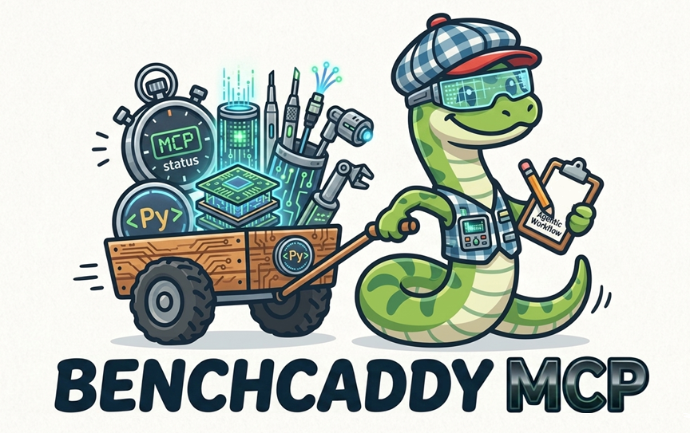

# BenchCaddy MCP

</img>

BenchCaddy ships a standalone MCP server that exposes benchmark inspection and baseline-management tools directly to coding agents.
Instead of constructing CLI commands and parsing `--json` output, an MCP client can call named tools against a BenchCaddy database.

## What It Is

BenchCaddy MCP is a thin tool surface over the existing BenchCaddy persistence and analysis API.
It is designed for agent workflows such as:

- discovering which benchmark suites exist
- inspecting suite history or a specific recorded run
- comparing runs or suite configurations
- reviewing trend data over time
- reading or updating the pinned suite baseline

The server is read-first. All tools are read-only except `pin_baseline`.

## Requirements

- install BenchCaddy in the same Python environment where the MCP server will run
- ensure the `benchcaddy-mcp` command is available on `PATH`, or use its full path in client configuration
- keep the benchmark database accessible to the client; tools default to `./benchcaddy.db` when `database_path` is omitted

If you are using this repository directly, the safest option is to point your MCP client at the executable inside `.venv` instead of assuming `benchcaddy-mcp` is globally available.

You can start the server directly with:

```bash
benchcaddy-mcp
```

Repository-local examples:

```powershell
.\.venv\Scripts\benchcaddy-mcp.exe
```

```bash
./.venv/bin/benchcaddy-mcp
```

## Setup By Environment

### Generic Stdio MCP Clients

Many MCP clients use a generic `mcpServers` configuration shape.

```json
{
    "mcpServers": {
        "benchcaddy": {
            "command": "benchcaddy-mcp"
        }
    }
}
```

### Claude Desktop

Add the server to `claude_desktop_config.json`, then restart Claude Desktop in the same environment where BenchCaddy is installed.

```json
{
    "mcpServers": {
        "benchcaddy": {
            "command": "benchcaddy-mcp"
        }
    }
}
```

### VS Code And GitHub Copilot

In VS Code, MCP servers are configured in `mcp.json`. For a workspace-local setup, create `.vscode/mcp.json`:

```json
{
    "servers": {
        "benchcaddy": {
            "type": "stdio",
            "command": ".\\.venv\\Scripts\\benchcaddy-mcp.exe"
        }
    }
}
```

POSIX workspace-local equivalent:

```json
{
    "servers": {
        "benchcaddy": {
            "type": "stdio",
            "command": "./.venv/bin/benchcaddy-mcp"
        }
    }
}
```

You can also use `MCP: Add Server` from the Command Palette and choose Workspace or Global.
When VS Code first detects the server, review the configuration and accept the trust prompt.
After that, BenchCaddy tools become available to GitHub Copilot in chat and agent mode.

If the server appears configured but no tools are usable, call `server_status` first. That confirms the server is reachable and shows which database path the server is resolving.

## Available Functionality

BenchCaddy MCP currently exposes these tools:

- `server_status`: minimal ping and database-path diagnostics for MCP setup checks
- `get_capabilities`: inspect server version, tool inventory, and the stable response contract
- `list_suites`: list recorded suites in the database
- `get_suite`: inspect one suite, including recent runs, environment data, and baseline context
- `get_run`: inspect one recorded run in detail
- `compare_suite`: compare runs within a suite against the best, a baseline, or a reference run
- `compare_runs`: compare two explicit runs directly
- `trend_suite`: inspect how one suite or one configuration changes over time
- `get_baseline_history`: inspect the baseline pin history for a suite
- `pin_baseline`: update the pinned baseline for a suite

Most tools accept an optional `database_path`. If omitted, they read `./benchcaddy.db`.
All tools also accept `response_detail`, which defaults to `summary`. Use `response_detail="full"` when you want the complete nested payload.

The response envelope is stable across all tools. Agents can branch on `status` and `reason` first, then inspect `summary`, and only opt into `result` when they need the full nested payload.

## First-Call Smoke Check

For a fresh client configuration, use this sequence before doing any benchmark analysis:

1. Call `server_status` with your expected `database_path`.
2. Call `get_capabilities` to verify tool inventory and the response contract.
3. Call `list_suites` to confirm the database contains benchmark data.

Example `server_status` call:

```text
Client: Call server_status with {"database_path": "C:/code/BenchCaddy/benchcaddy.db"}

BenchCaddy MCP:
{
    "schema_version": "1.0",
    "command": "server_status",
    "status": "pass",
    "reason": "server_ready",
    "error_code": null,
    "suggested_action": "Call get_capabilities for the full contract or list_suites to inspect benchmark data.",
    "confidence": "high",
    "response_detail": "summary",
    "summary": {
        "server_name": "BenchCaddy MCP",
        "server_version": "0.1.10",
        "schema_version": "1.0",
        "default_response_detail": "summary",
        "tool_count": 10,
        "tool_names": [
            "server_status",
            "get_capabilities",
            "list_suites",
            "get_suite",
            "get_run",
            "compare_suite",
            "compare_runs",
            "trend_suite",
            "get_baseline_history",
            "pin_baseline"
        ],
        "database": {
            "requested_path": "C:/code/BenchCaddy/benchcaddy.db",
            "resolved_path": "C:/code/BenchCaddy/benchcaddy.db",
            "exists": true,
            "uses_default_path": false
        }
    }
}
```

## Recommended Agent Workflow

For most benchmark analysis tasks, the clean flow is:

1. Call `server_status` if you are validating a new MCP client or database path.
2. Call `get_capabilities` if you need the server version, tool inventory, or contract details.
3. Call `list_suites` to discover available suites.
4. Call `get_suite` or `get_run` to load the relevant context.
5. Call `compare_suite`, `compare_runs`, or `trend_suite` for the actual analysis.
6. Call `get_baseline_history` before changing baseline policy.
7. Call `pin_baseline` only when you intentionally want to update the suite baseline.

## Response Shape

BenchCaddy MCP responses use a consistent envelope so agents can branch on outcome first and inspect payloads second.

- `status`: primary control signal, one of `pass`, `fail`, or `inconclusive`
- `reason`: stable snake_case classifier for the outcome
- `error_code`: machine-readable error identifier when the request failed
- `suggested_action`: useful next step for the caller
- `response_detail`: the effective detail mode, either `summary` or `full`
- `summary`: small tool-specific payload intended for direct agent answers
- `result`: full tool-specific payload, returned only when `response_detail="full"`

Predictability rules:

- every tool returns the same top-level envelope fields
- every tool accepts `response_detail`
- every tool that reads BenchCaddy data accepts `database_path`
- `summary` is the default agent-facing shape and `result` is opt-in

Default summary example based on a real local `compare_runs` response, with the database path normalized for documentation:

```text
Client: Call compare_runs with {"left_run_id": "4.2", "right_run_id": "4.3", "database_path": "/home/bench/benchcaddy/benchcaddy.db"}

BenchCaddy MCP:
{
    "schema_version": "1.0",
    "command": "compare_runs",
    "status": "pass",
    "reason": "comparison_complete",
    "error_code": null,
    "suggested_action": "Use the result payload to inspect classifications and candidate deltas.",
    "confidence": "high",
    "response_detail": "summary",
    "summary": {
        "comparison_mode": "direct",
        "baseline": {
            "display_id": "4.2",
            "suite_name": "nonlinear-transform",
            "target_name": "benchmark_case",
            "configuration": {
                "size": 512,
                "variant": "stabilized"
            },
            "sample_count": 20,
            "median_seconds": 0.00041360000614076853
        },
        "candidate": {
            "display_id": "4.3",
            "suite_name": "nonlinear-transform",
            "target_name": "benchmark_case",
            "configuration": {
                "size": 1024,
                "variant": "baseline"
            },
            "sample_count": 20,
            "median_seconds": 0.0009896999690681696
        },
        "same_configuration": false,
        "delta_seconds": 0.0005760999629274011,
        "percent_change": 139.28915724709293,
        "classification": "stable",
        "regression_detected": false,
        "statistically_significant": false,
        "exceeds_practical_threshold": true,
        "regression_probability": 1,
        "warnings": []
    }
}
```

When you need the full nested payload, call the same tool with `response_detail="full"`. The response still includes the compact `summary`, and adds the previous detailed `result` block for deeper inspection.