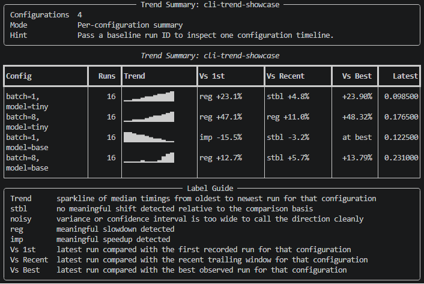

</img>

[](https://github.com/MatthiasLen/BenchCaddy/actions/workflows/ci.yml)

# BenchCaddy MCP

BenchCaddy MCP exposes BenchCaddy benchmark data and analysis as named MCP tools.
If the CLI or JSON output already fits your workflow, that is often enough. MCP is the simpler path when an agent should inspect suites, compare runs, review trends, or manage baselines through direct tool calls.
The default payloads are designed to stay compact, so they are usually much cheaper to pass to an agent than raw profiler traces or long benchmark logs.

## What It Is

BenchCaddy MCP is a thin layer over BenchCaddy's existing persistence and analysis API.
It exposes the same underlying benchmark data that the CLI reads, but in a form that agents can consume directly.

For the core Python API, CLI workflow, and general benchmarking concepts, see [README.md](README.md).

If you want to see what that looks like in practice before reading setup details, start with the example below.

Typical MCP workflows include:

- discovering which benchmark suites exist
- inspecting suite history or a specific recorded run
- comparing runs or suite configurations
- reviewing trend data over time
- reading or updating the pinned suite baseline

The server is read-mostly. All tools are read-only except `pin_baseline`.

## Example Chat: Recent Trends

This example shows the kind of concise benchmark summary an MCP-aware coding agent can produce after reading a generated trend database.

</img>

The database `cli_screenshot_trends.db` from this example can be generated using `scripts/generate_cli_screenshot_data.py`.

Representative chat:

```text
User: read benchmarking results cli_screenshot_trends.db and give me an overview on the recent trends in the results

Assistant: The generated trend database has one suite, `cli-trend-showcase`, with 64 runs across 4 configurations. The recent trend is mixed, but overall skewed toward regressions in 3 of the 4 configurations.

Recent overview:

- `tiny, batch=1`: long-term regression. Latest run is `0.0985s`, up from `0.0800s` initially, about `23.1%` slower. The most recent window looks roughly stable, with only about `4.8%` slowdown versus recent history.
- `tiny, batch=8`: clearest active regression. Latest run is `0.1765s`, up from `0.1200s` initially, about `47.1%` slower, and it is still worsening recently at about `11.0%` slower versus the recent window.
- `base, batch=1`: improvement story. Latest run is `0.1225s`, down from `0.1450s` initially, about `15.5%` faster, and it is also the best run seen for that configuration.
- `base, batch=8`: moderate regression. Latest run is `0.2310s`, up from `0.2050s` initially, about `12.7%` slower. Recent movement is a mild additional slowdown, but not enough to classify as a fresh regression in the recent window.

What stands out in the latest checkpoints:

- The latest four runs on `2026-06-02` are all clean, non-noisy measurements.
- The strongest current concern is `tiny, batch=8`, which is both substantially slower than its historical baseline and still trending worse recently.
- `tiny, batch=1` and `base, batch=8` also look degraded relative to their historical best or first runs, but their very recent movement is milder.
- `base, batch=1` is the only configuration showing a clear long-term improvement.
```

The MCP flow behind that answer is simple:

1. `list_suites` to discover the available suite name in the database
2. `trend_suite` to get configuration-level drift summaries
3. `get_suite` to inspect the latest runs and verify whether the newest samples are noisy

This is a good pattern for chat-oriented benchmark summaries because it combines:

- a stable inventory step
- an aggregate trend step
- a latest-run sanity check before drawing conclusions

## Requirements

- Install BenchCaddy in the same Python environment where the MCP server will run
- Ensure the `benchcaddy-mcp` command is available on `PATH`, or use its full path in client configuration
- Keep the benchmark database accessible to the client; tools default to `./benchcaddy.db` when `database_path` is omitted

If you are using this repository directly, the safest option is to point your MCP client at the executable inside `.venv` instead of assuming `benchcaddy-mcp` is globally available.

You can start the server directly with:

```bash
benchcaddy-mcp
```

Repository-local examples:

```bash
./.venv/bin/benchcaddy-mcp
```

## Setup By Environment

### Generic Stdio MCP Clients

Many MCP clients use a generic `mcpServers` configuration shape.

```json
{
    "mcpServers": {
        "benchcaddy": {
            "command": "benchcaddy-mcp"
        }
    }
}
```

### Claude Desktop

Add the server to `claude_desktop_config.json`, then restart Claude Desktop in the same environment where BenchCaddy is installed.

```json
{
    "mcpServers": {
        "benchcaddy": {
            "command": "benchcaddy-mcp"
        }
    }
}
```

### VS Code And GitHub Copilot

In VS Code, MCP servers are configured in `mcp.json`. For a workspace-local setup, create `.vscode/mcp.json`:

```json
{
    "servers": {
        "benchcaddy": {
            "type": "stdio",
            "command": "./.venv/bin/benchcaddy-mcp"
        }
    }
}
```

You can also use `MCP: Add Server` from the Command Palette and choose Workspace or Global.
When VS Code first detects the server, review the configuration and accept the trust prompt.
After that, BenchCaddy tools become available to GitHub Copilot in chat and agent mode.

If the server appears configured but no tools are usable, call `server_status` first. That confirms the server is reachable and shows which database path the server is resolving.

## Available Functionality

The tool surface is intentionally small and analysis-oriented:

- `server_status`: minimal ping and database-path diagnostics for MCP setup checks
- `get_capabilities`: inspect server version, tool inventory, and the stable response contract
- `list_suites`: list recorded suites in the database
- `get_suite`: inspect one suite, including recent runs, environment data, and baseline context
- `get_run`: inspect one recorded run in detail
- `compare_suite`: compare runs within a suite against the best, a baseline, or a reference run
- `compare_runs`: compare two explicit runs directly
- `trend_suite`: inspect how one suite or one configuration changes over time
- `get_baseline_history`: inspect the baseline pin history for a suite
- `pin_baseline`: update the pinned baseline for a suite

Most tools accept an optional `database_path`. If omitted, they read `./benchcaddy.db`.
All tools accept `response_detail`, which defaults to `summary`. Use `response_detail="full"` when you want the complete nested payload.

The response envelope is stable across all tools. Callers can branch on `status` and `reason` first, inspect `summary` for direct answers, and only opt into `result` when they need the full nested payload.
That summary-first shape is deliberate: it keeps typical agent interactions compact while still leaving the full nested payload available when deeper inspection is necessary.

## First-Call Smoke Check

For a fresh client configuration, use this sequence before doing benchmark analysis:

1. Call `server_status` with your expected `database_path`.
2. Call `get_capabilities` to verify tool inventory and the response contract.
3. Call `list_suites` to confirm the database contains benchmark data.

Example `server_status` call:

```text
Client: Call server_status with {"database_path": "/home/bench/benchcaddy/benchcaddy.db"}

BenchCaddy MCP:
{
    "schema_version": "1.0",
    "command": "server_status",
    "status": "pass",
    "reason": "server_ready",
    "error_code": null,
    "suggested_action": "Call get_capabilities for the full contract or list_suites to inspect benchmark data.",
    "confidence": "high",
    "response_detail": "summary",
    "summary": {
        "server_name": "BenchCaddy MCP",
        "server_version": "0.1.10",
        "schema_version": "1.0",
        "default_response_detail": "summary",
        "tool_count": 10,
        "tool_names": [
            "server_status",
            "get_capabilities",
            "list_suites",
            "get_suite",
            "get_run",
            "compare_suite",
            "compare_runs",
            "trend_suite",
            "get_baseline_history",
            "pin_baseline"
        ],
        "database": {
            "requested_path": "/home/bench/benchcaddy/benchcaddy.db",
            "resolved_path": "/home/bench/benchcaddy/benchcaddy.db",
            "exists": true,
            "uses_default_path": false
        }
    }
}
```

## Recommended Agent Workflow

For most benchmark analysis tasks, the clean flow is:

1. Call `server_status` if you are validating a new MCP client or database path.
2. Call `get_capabilities` if you need the server version, tool inventory, or contract details.
3. Call `list_suites` to discover available suites.
4. Call `get_suite` or `get_run` to load the relevant context.
5. Call `compare_suite`, `compare_runs`, or `trend_suite` for the actual analysis.
6. Call `get_baseline_history` before changing baseline policy.
7. Call `pin_baseline` only when you intentionally want to update the suite baseline.

## Response Shape

BenchCaddy MCP responses use a consistent envelope so callers can branch on outcome first and inspect payloads second.

- `status`: primary control signal, one of `pass`, `fail`, or `inconclusive`
- `reason`: stable snake_case classifier for the outcome
- `error_code`: machine-readable error identifier when the request failed
- `suggested_action`: useful next step for the caller
- `response_detail`: the effective detail mode, either `summary` or `full`
- `summary`: small tool-specific payload intended for direct agent answers
- `result`: full tool-specific payload, returned only when `response_detail="full"`

Predictability rules:

- every tool returns the same top-level envelope fields
- every tool accepts `response_detail`
- every tool that reads BenchCaddy data accepts `database_path`
- `summary` is the default agent-facing shape and `result` is opt-in

This is usually a better fit for agent workflows than feeding raw profiler traces or the full text output of standard benchmarking tools. It is not a profiler replacement, though. If you need call-stack-level or trace-level detail, use a profiler and treat BenchCaddy as the compact inspection layer over recorded benchmark results.

Default summary example based on a real local `compare_runs` response, with the database path normalized for documentation:

```text
Client: Call compare_runs with {"left_run_id": "4.2", "right_run_id": "4.3", "database_path": "/home/bench/benchcaddy/benchcaddy.db"}

BenchCaddy MCP:
{
    "schema_version": "1.0",
    "command": "compare_runs",
    "status": "pass",
    "reason": "comparison_complete",
    "error_code": null,
    "suggested_action": "Use the result payload to inspect classifications and candidate deltas.",
    "confidence": "high",
    "response_detail": "summary",
    "summary": {
        "comparison_mode": "direct",
        "baseline": {
            "display_id": "4.2",
            "suite_name": "nonlinear-transform",
            "target_name": "benchmark_case",
            "configuration": {
                "size": 512,
                "variant": "stabilized"
            },
            "sample_count": 20,
            "median_seconds": 0.00041360000614076853
        },
        "candidate": {
            "display_id": "4.3",
            "suite_name": "nonlinear-transform",
            "target_name": "benchmark_case",
            "configuration": {
                "size": 1024,
                "variant": "baseline"
            },
            "sample_count": 20,
            "median_seconds": 0.0009896999690681696
        },
        "same_configuration": false,
        "delta_seconds": 0.0005760999629274011,
        "percent_change": 139.28915724709293,
        "classification": "stable",
        "regression_detected": false,
        "statistically_significant": false,
        "exceeds_practical_threshold": true,
        "regression_probability": 1,
        "warnings": []
    }
}
```

When you need the full nested payload, call the same tool with `response_detail="full"`. The response still includes the compact `summary`, and adds the previous detailed `result` block for deeper inspection.

